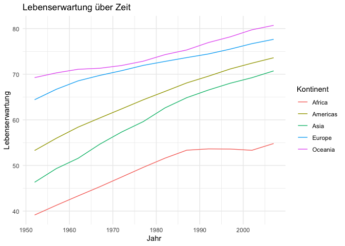

# Report GapMinder
Julius Müller
2026-06-06

## Ziel dieses Reports

Dies ist mein erster Report in RStudio, der über Quarto eingegeben und
anschließend auf GitHub veröffentlicht wird. Es handelt sich deswegen um
einen Test, das Endprodukt soll allein zur Veranschaulichung dienen. Es
geht darum sich mit den Möglichkeiten von sowohl RStudio, Quarto als
auch Git(Hub) vertraut zu machen. Ich hoffe daraus weitere Vorteile für
mein Studium der Politik- wissenschaften zu erlangen und mir später mein
ausgesprochenes Ziel Doktor zu werden, zu ermöglichen.

Im Verlauf dieses Dokuments soll anhand einer kleinen “Forschungsfrage”,
ein Report entstehen. Das Endprodukt ist nicht ernst zu nehmen.

## Die Forschungsfrage

Die nachfolgende Forschungsfrage wurde KI-generiert und soll mich dazu
bringen, ihr deskriptiv zu folgen: Wie entwickelt sich die
Lebenserwartung über Zeit nach Kontinenten?

## Die Daten

Die Daten zur Ermittlung der Forschungsfrage kommen aus dem über RStudio
herunterzuladenden `gapminder` Datensatz. Dieser beinhaltet die
Lebenserwartung von 142 Ländern über den Zwitraum 1952 bis 2007.

## Eine erste Übersicht über die Daten

``` r
head(daten) |> 
  knitr::kable()
```

| country     | continent | year | lifeExp |      pop | gdpPercap |
|:------------|:----------|-----:|--------:|---------:|----------:|
| Afghanistan | Asia      | 1952 |  28.801 |  8425333 |  779.4453 |
| Afghanistan | Asia      | 1957 |  30.332 |  9240934 |  820.8530 |
| Afghanistan | Asia      | 1962 |  31.997 | 10267083 |  853.1007 |
| Afghanistan | Asia      | 1967 |  34.020 | 11537966 |  836.1971 |
| Afghanistan | Asia      | 1972 |  36.088 | 13079460 |  739.9811 |
| Afghanistan | Asia      | 1977 |  38.438 | 14880372 |  786.1134 |

## Wie entwickelt sich die Lebenserwartung über Zeit nach Kontinenten?

``` r
daten |> 
  group_by(continent, year) |> 
  summarise(lebenserwartung = mean(lifeExp)) |> 
  ggplot(aes(x = year, y = lebenserwartung, color = continent)) +
  geom_line() +
  labs(title = "Lebenserwartung über Zeit", x = "Jahr", y = "Lebenserwartung",
       color = "Kontinent") + 
  theme_minimal()
```



## Ergebnis

Auf allen Kontinenten ist ein Anstieg der Lebenserwartung festzustellen.
